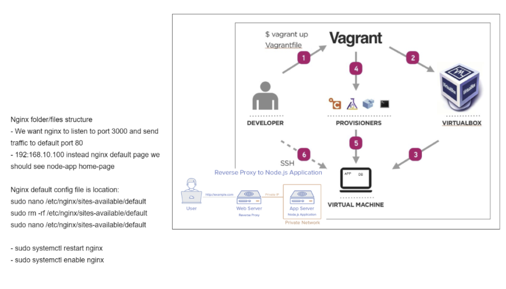

# Multi Machine(app & db) Virtual Machine Automation with Reverse Proxy

-Create Vagrantfile to setup Virtual Machines(app & db) and sync the app and provision folders into the VMs
```Vagrantfile
# Install required plugins
required_plugins = ["vagrant-hostsupdater"]
required_plugins.each do |plugin|
    exec "vagrant plugin install #{plugin}" unless Vagrant.has_plugin? plugin
end

def set_env vars
  command = <<~HEREDOC
      echo "Setting Environment Variables"
      source ~/.bashrc
  HEREDOC

  vars.each do |key, value|
    command += <<~HEREDOC
      if [ -z "$#{key}" ]; then
          echo "export #{key}=#{value}" >> ~/.bashrc
      fi
    HEREDOC
  end

  return command
end

Vagrant.configure("2") do |config|
  config.vm.define "app" do |app|
    app.vm.box = "ubuntu/xenial64"
    app.vm.network "private_network", ip: "192.168.10.100"
    app.hostsupdater.aliases = ["development.local"]
    app.vm.synced_folder "app", "/home/vagrant/app"
    app.vm.provision "shell", path: "environment/app/provision.sh", privileged: false
    app.vm.provision "shell", inline: set_env({ DB_HOST: "mongodb://192.168.10.150:27017/posts" }), privileged: false
  end

  config.vm.define "db" do |db|
    db.vm.box = "ubuntu/xenial64"
    db.vm.network "private_network", ip: "192.168.10.150"
    db.hostsupdater.aliases = ["database.local"]
    db.vm.synced_folder "environment/db", "/home/vagrant/db"
    db.vm.provision "shell", path: "environment/db/provision.sh", privileged: false
  end
end
```
- - create provisioning file for the app on the host machine
  ```provision.sh for app
  #!/bin/bash

# Update the sources list
sudo apt-get update -y

# upgrade any packages available
sudo apt-get upgrade -y


# install git
sudo apt-get install git -y

# install nodejs
sudo apt-get install python-software-properties -y
curl -sL https://deb.nodesource.com/setup_6.x | sudo -E bash -
sudo apt-get install nodejs -y

# install pm2
sudo npm install pm2 -g

sudo apt-get install nginx -y

# remove the old file and add our one
sudo rm /etc/nginx/sites-available/default
sudo cp /home/vagrant/app/default.conf /etc/nginx/sites-available/default

# finally, restart the nginx service so the new config takes hold
sudo service nginx restart
```
- create provisioning file for the database on the host machine
```provision.sh for db
# be careful of these keys, they will go out of date
sudo apt-key adv --keyserver hkp://keyserver.ubuntu.com:80 --recv D68FA50FEA312927
echo "deb https://repo.mongodb.org/apt/ubuntu xenial/mongodb-org/3.2 multiverse" | sudo tee /etc/apt/sources.list.d/mongodb-org-3.2.list

sudo apt-get update -y
sudo apt-get upgrade -y

# sudo apt-get install mongodb-org=3.2.20 -y
sudo apt-get install -y mongodb-org=3.2.20 mongodb-org-server=3.2.20 mongodb-org-shell=3.2.20 mongodb-org-mongos=3.2.20 mongodb-org-tools=3.2.20

# remoe the default .conf and replace with our configuration
sudo rm /etc/mongod.conf
sudo ln -s /home/vagrant/db/mongod.conf /etc/mongod.conf

# if mongo is is set up correctly these will be successful
sudo systemctl restart mongod
sudo systemctl enable mongod
```
- create default.conf on the host machine to setup reverse proxy through provisioning in the app VM
  ```default.conf
  server {
  listen 80;
  server_name development.local;

  location / {
    proxy_pass http://192.168.10.100:3000;
  }

  location /posts {
    proxy_pass http://192.168.10.100:3000/posts;
  }
}
```
- create a mongod.conf to configure the database to allow the app to access the db VM
  ```mongod.conf
  # network interfaces
  net:
    port: 27017
    bindIp: 0.0.0.0
 ```
- Now, run `vagrant up` to spin the app & db VMs
- Let's get into the app VM to start the app as below:
  ```
  cd /home/ubuntu/app
  npm install
  npm start
  ```
  - Now we can see the app running at `http://192.168.10.100` with reverse proxy
